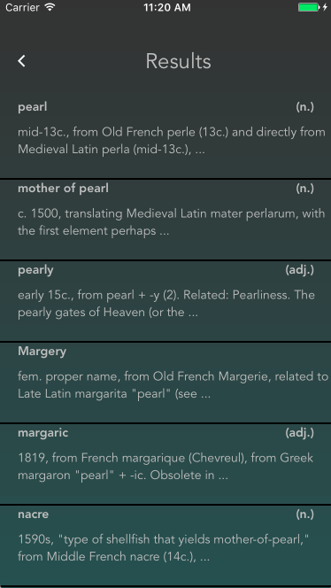
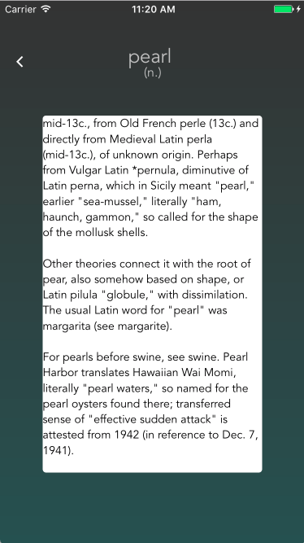

# Etym 

### An iPhone App for Learning Word Origins
(Powered by [The Online Etymology Dictionary](http://www.etymonline.com))
- - - - - - - - - - - - - - - - - - - - - - - - - - - - - - - - - - - - - 
###Screen Shots

  

    
    
    
  

With Etym at your fingertips, you can finally scratch your word-origin itch in just a matter of seconds. Its as simple as a Google Search! 
